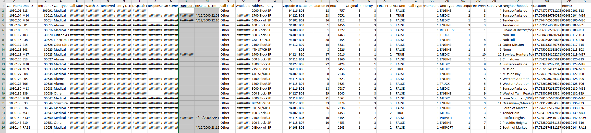
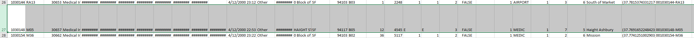

# H1 Jeremy's_Data_Analytics_Portfolio
Olympic data analyzed, Fire fighters resources and schedules optimized, advanced SQL joins

things to note for good story telling on this:
Intro, problem statement, skills demonstrated, data sourcing, data transformation, data modeling, analysis and visualization, conclusion and recommendation.

Intro (Power BI concepts applied), DAX, Data modeling (Star Schema)

Start with a stock image.

# Intro

# Problem Statement

# Data Sourcing
.csv file, extracted into Power Bi.

Describe the columns and values etc.

# Data Transformations

## I noticed immediately upon loading the data that there was a significant amount of null values where the data was supposed to be. 

## While analyzing the data a bit more I noticed that values for the Priority column were supposed to be numeric (1-3) but were instead labeled as characters (N for Non-Emergency and E for Emergency) 

How I changed the data. Screenshot of data modeling

Screenshot of visual and description

# Data Modeling

# Analysis

# Visualization

Publish powerBi
Take screenshots

# Conclusion

Thank you for reading! :-)

