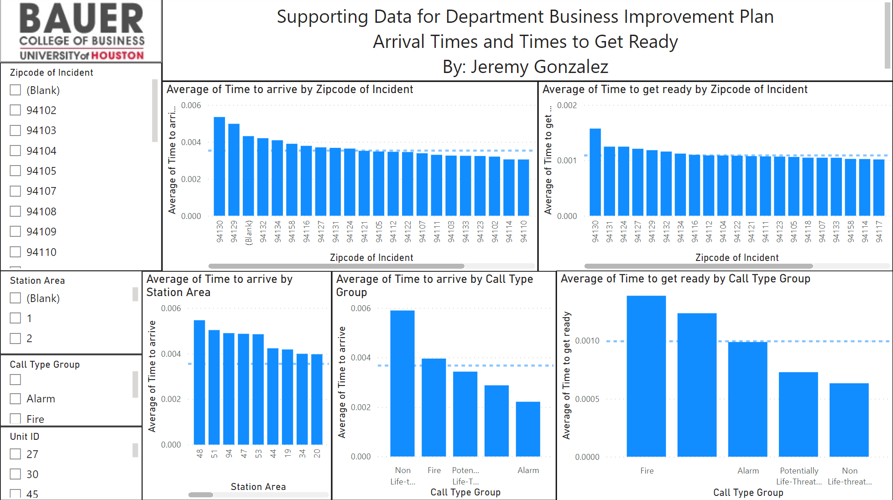
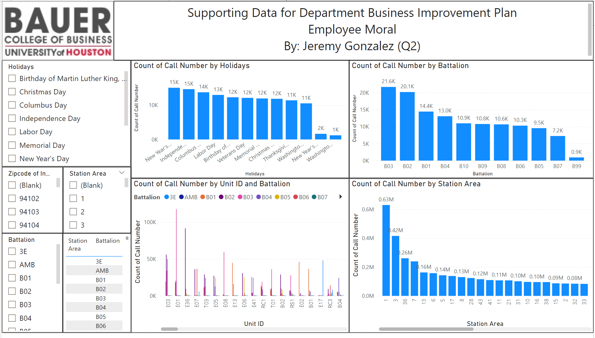

# Fire Fighting Consulting Project

# Introduction
As part of the final assessment project in my Data Visualization course, I undertook a consulting role for a local fire department. Tasked with investigating and addressing several core issues within the organization, the assignment offered a prime opportunity to leverage data analytics and visualization techniques in a real-world setting. The main challenges posed by the Fire Department Chief were threefold: improving department morale, effectively balancing the workload, and streamlining the allocation of resources. This project was a deep dive into the fire department's operational data, which I leveraged to provide data-driven solutions to the stated challenges. The project timeline would be two weeks. Week one, meet with the fire chief for one hour, get to know his concerns, and understand what he hopes to accomplish with this data. Week two, a thirty-minute follow-up interview to review any concerns, note any final adjustments his team needs, and get any problems that arise taken care of. Lastly, present the dashboards to the Fire Chief and staff, and submit the dashboards for their future usage. 

# Problem Statement
The Fire Department Chief highlighted several significant concerns that were negatively impacting the department. Morale was low due to the perception of overwork, especially during holiday periods, because of their 24-hour on, 24-hour off shift pattern. Workload distribution, he noted, was also a considerable problem, as resources were not being allocated based on data-driven decision-making. Rather, the allocation was primarily conducted based on gut feelings or intuition. Additionally, the need for regular training throughout the year, which should ideally be scheduled during slower periods, was also emphasized. In essence, the critical issue was the lack of data-driven decision-making strategies across the board, from scheduling to resource allocation and training.

# Data Sourcing
The primary source of data for this project was the department's records themselves, which were shared in the form of a .csv file named "Fire_Department_Calls_For_Service". This dataset was rich with historical records, encompassing detailed information about call times, shifts, resource allocation, and other pertinent operational details. It offered a comprehensive view of the department's operations, providing the necessary insight to drive data-based decisions and address the chief's concerns effectively.

By integrating and visualizing the data from "Fire_Department_Calls_For_Service", the project aimed to create actionable insights that would enable the department to improve their scheduling practices, distribute the workload more evenly, and allocate resources more effectively. The goal was to assist the fire department in moving from a system reliant on intuition to one that uses data to drive decisions, thereby improving operational efficiency and employee morale.

# Data Transformations

I noticed immediately upon loading the data that there was a significant amount of null values where the data was supposed to be. 

While analyzing the data a bit more I noticed that values for the Priority column were supposed to be numeric (1-3) but were instead labeled as characters (N for Non-Emergency and E for Emergency) 

As expected, errors were seen when loading the data into PowerBi.

Now holidays which is needed for understanding the morale can be analyzed.

# Data Modeling 

##I finally adjusted the dates by Creating a table that contained all the federal holidays and joining it to the data table. I then linked that to the date table to create a connection with a cardinality of 1 to many as there can be many cases per day. Finally, the data could be properly formatted for analysis.

# Analysis

I noticed some interesting trends at first glance. Here The dashboard conveys an increase in call volume, but a  steep drop off in the "other" category and an increase in Fire, and Code 2 transport. Suggesting reporting standards increased between 2013-2014. You expect with call volume going up all types of calls would go up.

# Visualization

I knew that this dashboard was going to be submitted for the Fire Cheif and team for them to use in the future. I wanted to include filters on the left, so they could sort through the visuals by groups and dive deep into the data. Additionally, because this is a project I did in school, I added the school logo on the top left (Go Coogs!).

In my first slide, I really wanted to highlight the need for my services. I wanted my customer to feel comfortable with the services I provide and demonstrate visually that their need for strategic change is necessary and should be data-driven to make an impact. Observing the number of calls by call date there is an increasing trend in the number of calls. If all numbers are increasing, it will become of growing importance to achieve efficiency to save as many lives as possible and serve the community as best as possible. When observing the call number by zip code, 94102 contained the greatest number of calls at 12.5% of the total calls followed by zip codes 94103 and 94110 at 11.98% and 8.52% of calls respectively. Station area 1 contained the greatest number of calls at 295,000 followed by stations 3 and 36 at 193,000 and 127,000 respectively. Here 11 Fire Prevention Districts oversee 28 zip codes or 42 neighborhoods. Collectively, the fire prevention districts have answered nearly 4.8 million distress calls. 

Here the dashboard is arranged in a variety of ways that demonstrate what areas are taking the longest when responding to a call. The dashed blue line represents the average time it took across the board for a call to be responded to, thus being above the dashed blue line indicates being slower than average. When comparing the Average time to arrive by zip code, the first 10 zip codes are slower than average with zip code 94130 being the slowest. Furthermore, the average time to get ready to respond was also the highest with 94130, meaning they are the slowest to arrive and slowest to get ready. The average time to arrive is a metric by subtracting the time the battalion received the call from the time they arrived. The average time to get ready is a metric calculated by subtracting the time the battalion received the call from the time they load up the truck with everyone fully supplied and leave the station. When comparing the time took to arrive by Station area, Stations 48, 51, 94, 47, 53, 44, 19, 34, and 20 are slower than average Stations. Fortunately, non-life-threatening calls are the calls that received the highest time to arrive indicating appropriate response times to scenarios. Sadly, the only other category above average response times was Fire calls. Finally, when observing what call category took the longest to get ready, it was Fire. 

Another concern the police chief had was if the priority was correct. Were they wasting resources that they didn’t need? For example, a cat stuck in a tree isn’t going to take the medic team equipment and the fire team equipment when they only needed rescue squad equipment. This dashboard highlights the change in original priority and final priority. The white lines differentiate the portion of those calls that did not require the services they received a call for and calls that had the appropriate teams sent to the call. Across all call types, nearly all had a 1% rate of being incorrect, except for Engine calls. Engine calls had the greatest type of mismatch at nearly 12% being incorrect. Furthermore, when looking at the average time to arrive, by Call type, Aircraft, administrative, Mutual Aid/Assist Outside of Agency, High Angel Rescue, Water Rescue, Suspicious Package, Train/Rail incidents, Marine Fires, and Hazmat call types had the slowest response times in that order. With Administrative being the second-highest response time, I believe that is an appropriate category to be behind in. While it is important to be timely, these calls are not life-threatening. The count of Response Times by station area again highlights who is receiving the highest volume of calls, and dispatching the most units while the table next to it allows for the user to easily identify who is receiving the greatest number of calls that are of highest priority i.e., does a station who is dispatching often, dispatching to more high priority calls or more low priority calls. 

Looking deeper, of the nearly 470,000 calls that firefighters responded to, a total of 101,020 calls had the priority go down. As in, they sent the wrong resources to the response call. A nearly 25% number of calls where they are sending in too many resources. While 228,822 calls, or nearly 50% of the calls, the priority went up, and thus, they did not send the appropriate resources and response teams. These changes were observed via a measure that calculated the difference in Original Priority, the Priority that was assigned by the dispatcher, vs Final priority or what was needed by the caller. Here the Average Call type arrives to hover or click and compare by Unit type. Looking at the Average time to arrive by Unit type, Investigation, support, and Private investigation were the only units to be arriving later than other units. This makes sense as these typically arrive after the scene has been taken care of or after the units dispatched need additional resources. Furthermore, observing the average time to get ready by call type, Administrative, assisting police, and suspicious packages took the longest to respond to and were above the average response time. Finally, observing the count of Call Date and Count of Available Dt Time highlights the contrast between how many calls were made, but sent to another district. E36, E101, and E03 received the most number of calls that were sent to another district to respond to. 

Here we can historically observe the greatest amount of call volume by holidays. New Year’s and Independence Day were the highest call days by holiday, likely due to the fireworks associated with the holidays. Despite being the largest amount of holiday incidents, most Holidays are in a. The holiday with the lowest number of incidents was Washington’s Day at about 1,000 incidents followed by New Year at about 2,000 calls. New Year’s and Washington’s Day are the outliers of the holidays because every other holiday has 11,000-15,000 total calls. Moreover, the number of call numbers when organized by the Battalion showed that other groups were answering significantly more calls than other Battalions with B03 answering about 21,600 calls and B09 answering less than 1,000 calls.  Similarly, when observing call number count by the Station Area, station 1 is answering much more than average at about 0.63 M, the next highest being stations 3 and 36 and .42M and .26M respectively. Station 1 performs nearly 3x as much work as Station 36 the third most call receiver. When observing the Count of Call Numbers by Unit Id and Battalion it becomes clear Station area E01 of Battalion B03, B02, B01, B08, B07, B05, and B99 is working significantly more calls than other groups. B03 took the bulk of the calls at over 10,000 more calls than B02, the second highest call responders in Station area E01.

# Conclusion
Along with my presentation and dashboards, I wrote a document that I belive addressed all 5 of the Fire Chiefs biggest questions he needed addressed. 

### What area had the greatest need for resources? Is the need for this area truly represented by the data or skewed? 
Based on the current data, from 2000 to 2020 call numbers have been increasing over time. It can be expected that calls will continue to increase into the future. Due to the projected increase in calls, it is important to identify areas with the greatest need for resources. The area that had the greatest need for resources was zip code 94102 taking 12.54% of all calls. Of those calls, 23.3% of those calls were grouped as potentially life-threatening. Zip code 94102 spans 3 Fire Prevention districts and 7 neighborhoods. By strategically adding more units to zip codes 94102, 94103, and 94110 (the three largest zip codes by call demand) you can better meet the needs of individuals. Lastly, the data is somewhat skewed, but not considered to be a major factor as zip codes that were left bank during the data collection process amounted to 0.29% of the calls.

### Which employee worked the greatest number of hours? Were these hours during holiday time? Is it feasible to have the least number of workers during the holidays?
Battalion B03 reported the greatest number of calls from 2000 to 2020 at 21.6k. Followed by B02 at 20.1k and B01 at 14.4k. Battalion B99, B07, and B05 had the least number of calls from 2000 to 2020 at 0.9k, 7.2k, and 9.5k respectively. Battalion B03 attended the greatest number of calls for every holiday except for MLK day where B02 attended the greatest number of calls from 2000 to 2020.
Alternatively, looking at the data by station, station 1 and station 3 reported the greatest number of calls at 0.63 million and 0.42 million respectively. While Stations 94, 53, 47, and 27 received significantly fewer calls at 0.00 million calls.  By adding more manpower to stations 1 and 3, employees there may not feel as overworked and will be able to rotate working on holidays more efficiently. Given that 3 workers must be on shift per station, it would not be as efficient to continue to add workers to stations 94, 53, 47, and 27.

### Are any locations lacking resources? Calculated by measuring response time and a number of incidents, would minimize certain variables such as vehicle downtime allows for better response times? 
Measured in days, “Time to arrive” was calculated by subtracting the on-scene time from the response time. This was represented as a new column in the chart. Additionally, “Time to get ready” was calculated by subtracting the response time from the dispatch time which is also represented in days. Non-threatening call types had the longest response time, which shows the department is handling higher priority calls accordingly. Zip code 94130 contained both the longest time to arrive and the longest times for units to arrive on the scene indicating they are lacking resources such as vehicles or could use greater training in preparation work. By station, station area 48 had the longest average time to get on the scene compared to other station areas. Alternatively, station areas 41 and 38 had the lowest average time to arrive on the scene. By supplying more trucks and employees to zip codes 94130, and 94129, the zip codes with the longest arrival times, calls may be answered more swiftly. 

### Which call type had the greatest mismatch in priority levels? By sending vehicles without ALS to a certain call type or low priority code, does this result in a demand for extra units to be dispatched thus resulting in “wasted” manpower? 
Medical incidents had the greatest mismatch in priority levels. Medical incidents increased in priority levels 219,187 times, while they went down in priority levels 97,745 times. Medical incidents also have the lowest times to get ready, but the longest times to arrive, thus placing people at risk by mismatching the call types. The mismatch in priority levels results in the possible loss of lives. ALS availability seems to make no impact, as the priority level went up 44,639 times when ALS was not present but 174,548 times despite ALS being available. To improve priority level mismatches, during medical incidents I would increase the priority level on average, to assure proper personnel and equipment are delivered in an appropriate manner. Alternatively, call types such as alarms and administrative were the second-lowest for increased call time, meaning the dispatch units are correctly allocating the resources for those types of calls. 

### What is the average dispatch time, and the time it takes for someone to get to the hospital? Given the total time, how can the time to dispatch + time to the hospital be reduced?

Although the medical units took the least amount of time to get ready and leave the scene, they were the fourth slowest to arrive on the scene. The fourth slowest was also the average time, meaning they on average, did not perform better or worse than other units.	 Average hospital time delivery can be reduced by increasing the priority levels of medical calls.

Thank you for reading! :-)

